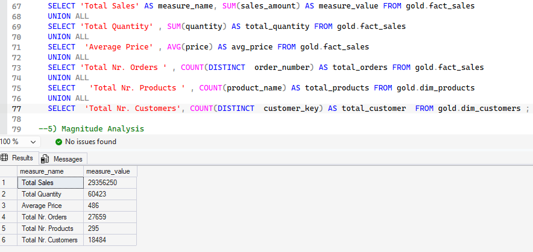
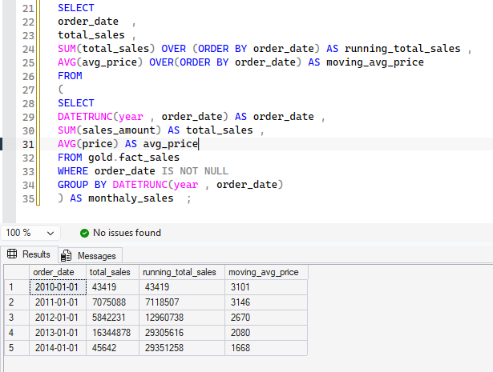

# SQL-Exploratory-Data-Analysis-Learning-Project
EDA using SQL Server Management Studio 22

## 📸 Project Screenshots

###  Business Insights

# SQL Exploratory Data Analysis (EDA)

## 📌 Project Overview

This project demonstrates Exploratory Data Analysis (EDA) using SQL.

I completed this project as part of my SQL learning journey and used SQL queries to explore the dataset, understand its structure, identify patterns, calculate key metrics, and generate business insights.

The project helped me practice:

* Database exploration
* Data understanding
* Aggregations and GROUP BY
* JOINs
* Date-based analysis
* Window functions
* CTEs
* CASE statements
* Ranking and segmentation
* Business-oriented SQL analysis

## 🛠️ Tools Used

* SQL Server
* SQL
* SSMS
* GitHub

## 📊 Analysis Performed

The analysis includes:

1. Database exploration
2. Understanding dimensions and measures
3. Exploring customers and products
4. Measuring sales and revenue
5. Time-based analysis
6. Performance analysis
7. Customer segmentation
8. Product analysis
9. Identifying trends and patterns
10. Generating business insights

## 📚 Learning Source & Attribution

This project was created for educational and portfolio purposes.

I learned the SQL EDA methodology and project structure from **Data With Baraa** and used the dataset/materials provided through his SQL EDA learning resources.

Original source:

* Data With Baraa: https://www.youtube.com/@DataWithBaraa
* SQL Data Analytics Project: https://github.com/DataWithBaraa/sql-data-analytics-project

All credit for the original dataset and learning materials belongs to Data With Baraa.

This repository represents my learning and practice using SQL. I have not created the original dataset or tutorial materials.

## 🎯 What I Learned

Through this project, I improved my ability to use SQL for exploratory analysis and learned how to move from raw data to meaningful business insights.

I also practiced writing SQL queries in a structured way and understanding how different SQL techniques can be combined to answer analytical questions.

